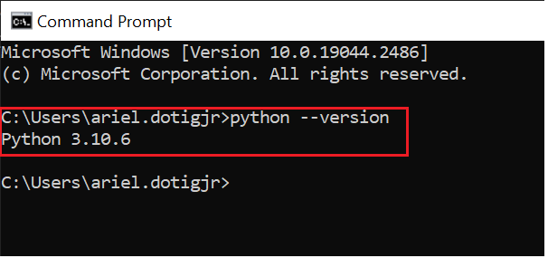

# Training prerequisites for Python Training - Fundamentals

1.  Check if you already have Python (any version from 3.9 or higher is okay) by opening your command prompt and issuing the command `python --version`. If it returns a version number, then you already have it installed. If you have a python version lower than ***3.9***, uninstall it from control panel and proceed to the next step.

2. If you don't have Python installed in your system, then you can follow these instructions to install it. 
- Download Python from the official python website [here](https://www.python.org/downloads/).
    
    

- After the download completes, double click the file and install Python. You need to check **Use admin privileges when installing python** and **Add python.exe to PATH** then you can click the **Install Now** button.

    

3. Once you have Python installed correctly, it should already have pip as well. Pip is the package manager for Python, this is what we use to install modules, libraries or dependencies that we might need in the future once we are creating our own script. To confirm that you hhave pip installed, open your command prompt and type the command `pip --version` and it should return the current version of your pip.

4. The last item that we need to install is jupyter notebook. You can install it using pip, open your command prompt and type in the command `pip install jupyter notebook` . A successful install will look like below image (note that below screenshot is for a different library)

5. To verify that you've installed Jupyter Notebook correctly, you can create a folder anywhere within your computer. Open a command prompt inside that folder and type in `jupyter notebook` and it should open up your default browser with below page. We will use **Jupyter Notebook** to create and run the scripts since it will be easier in this IDE when you are trying to learn Python.

### Note: To install Python and pip, you will need admin privileges on your laptop. If you have any issues on installing any of the prerequisites, please reach out to me via Teams or email.
