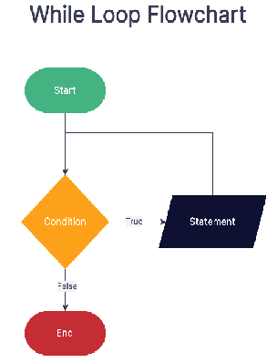

# While loops
## Flowchart

## Syntax
Like any other Python loops, the line of code that contains the while statement and expression needs to be terminated by the ***colon(:)*** character and the ***block of codes inside the loop should be intdented.***
```python
number_less_than_100 = int(input('Enter a number, I will ask you again if it is less than 100: '))
while number_less_than_100 < 100:
    if number_less_than_100 < 100
    print(f'Your input {number_less_than_100} is less than 100. Please enter a number again.')
    number_less_than_100 = int(input('Enter a number, I will ask you again if it is less than 100: '))
```